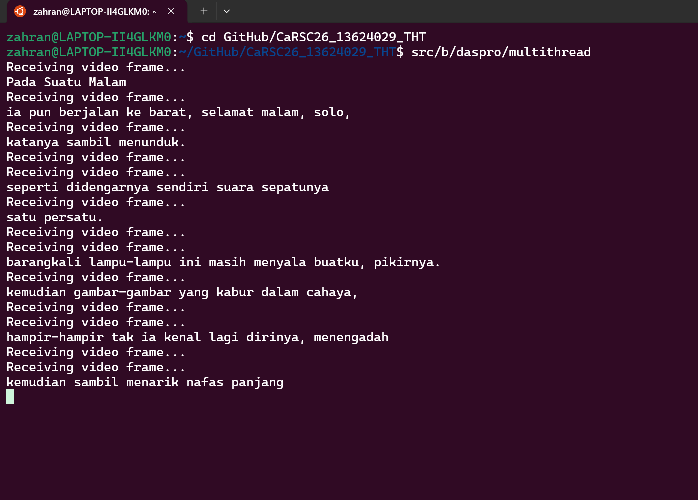

# Bagian B

## Dasar Pemrograman

## 1. OOP _Programming_
 b. Berikut adalah [kode](../src/b/daspro/telemetry_oop.cpp) untuk penyelesaian tugas ini.  
 Terima kasih kepada fitur AI dari VSC yang telah membantu mengetik kode. Design pattern yang digunakan saat ini adalah _Strategy Pattern_.

## 2. Sintaks C++
 a. Perbedaan <code>#include &ltfile_name&gt</code> dan <code>#include "file_name"</code>  
  - <code>#include &ltfile_name&gt</code> : Preprosesor melakukan pencarian file header di direktori yang telah disiapkan oleh kompiler/IDE. File header yang dicari biasanya berasal dari _standard library_ C.
  - <code>#include "file_name"</code> : Preprosesor melakukan pencarian file header di direktori yang sama dengan file kode. File header yang dicari biasanya berasal dari programer itu sendiri dan tidak terdaftar di _standard library_ C.
  - Contoh : <code>#include &ltbits/stdc++.h&gt</code> atau <code>#include "telemetry_processor.cpp"</code>

  **Source** : [stackoverflow.com](https://stackoverflow.com/questions/21593/what-is-the-difference-between-include-filename-and-include-filename)

 b.  
  - <code>#ifdef</code> : Digunakan untuk menyertakan bagian kode jika makro tertentu didefinisikan oleh <code>#define</code>.  
  - <code>#ifndef</code> : Digunakan untuk menyertakan bagian kode jika makro tertentu tidak didefinisikan oleh <code>#define</code>.  
  - <code>#endif</code> : Digunakan untuk menandai akhir dari <code>#if</code>, <code>#ifdef</code>, dan <code>#ifndef</code>.  
  - <code>#pragma once</code> : Untuk memastikan bahwa header hanya disertakan sekali.  

  **Source** : [geeksforgeeks.org](https://www.geeksforgeeks.org/cpp/cpp-preprocessor-directives-set-2/)  

 c.   
  - _namespace_ : Label / wadah khusus yang menampung sekelompok nama seperti variabel, fungsi, kelas, dll. Label ini digunakan untuk menghindari kebingungan ketika nama yang sama digunakan di berbagai bagian program atau ketika kita menggunakan kode dari berbagai sumber.  
  - _Scope resolution operator_ (<code>::</code>) : Digunakan untuk mengakses _identifiers_ seperti nama variabel dan nama fungsi yang didefinisikan di dalam cakupan / kode lain pada kode saat ini.  
   - Contoh : <code>namespace std</code> dan <code>std::cout</code>  

   **Source** : geeksforgeeks.org [link-1](https://www.geeksforgeeks.org/cpp/namespace-in-c/) [link-2](https://www.geeksforgeeks.org/cpp/scope-resolution-operator-in-c/)  

 d.  
  - <code>#define</code> : Praprosesor direktif yang digunakan untuk mendefinisikan makro. Makro adalah cara untuk merepresentasikan fragmen kode atau nilai konstan dengan memberikannya nama.
  - <code>using</code> : Sebuah alat yang memungkinkan developer untuk menggunakan _namespace_ tertentu. Alat ini berguna jika kita tidak ingin mengetik nama _namespace_ setiap kali kita ingin menggunakan sesuatu dari _namespace_ tersebut.  
  - Contoh : <code>#define PI 3.1416</code> dan <code>using namespace std;</code>

  **Source** : geeksforgeeks.org [link-1](https://www.geeksforgeeks.org/cpp/define-preprocessor-in-cpp/) [link-2](https://www.geeksforgeeks.org/cpp/using-keyword-in-cpp-stl/)  

 e.  
  - _Pointer_ <code>*</code> : Digunakan untuk menyimpan _memory address_ dari sebuah variabel. Mekanisme ini dapat digunakan untuk membuat dan memanipulasi struktur data dinamis. 
  - _Address_ <code>&</code> : Digunakan sebagai nama alternatif dari sebuah variabel (variabel referensi). Mekanisme ini menggunakan lokasi memori yang sama dengan variabel referensi.
  - Contoh : <code>int& ref = x</code> dan <code>int* ptr = &x</code>.  

  **Source** : [geeksforgeeks.org](https://www.geeksforgeeks.org/cpp/pointers-and-references-in-c/)  

 f.  
  - _Pass by value_ : Dalam metode ini, nilai suatu variabel disalin dan kemudian diteruskan ke fungsi. Akibatnya, perubahan yang terjadi pada parameter di dalam fungsi tidak akan memengaruhi nilai asli variabel tersebut.
  - _Pass by reference_ : Dalam metode ini, referensi argumen / variabel akan diteruskan ke fungsi. Akibatnya, fungsi dapat melakukan perubahan pada nilai asli dari argumen / variabel tersebut.
  - Contoh : <code>void operasi(int a, int b) {}</code> dan <code>void ubah(int& a, int &b) {}</code>

  **Source** : [geeksforgeeks.org](https://www.geeksforgeeks.org/cpp/parameter-passing-techniques-in-cpp/)  

 g.  
  - <code>std::unique_ptr</code> : Sebuah _pointer_ cerdas yang memiliki dan mengelola objek lain melalui pointer dan membuang objek tersebut ketika <code>std::unique_ptr</code> keluar dari cakupan / _out of scope_. Sebuah objek hanya dapat dimiliki oleh 1 <code>std::unique_ptr</code> saja.
  - <code>std::shared_ptr</code> : Sebuah _pointer_ cerdas yang mempertahankan kepemilikan bersama suatu objek melalui sebuah pointer. Sebuah objek dapat dimiliki oleh lebih dari 1 <code>std::shared_ptr</code>.

  **Source** : cppreference.com [link-1](https://en.cppreference.com/w/cpp/memory/unique_ptr.html) [link-2](https://en.cppreference.com/w/cpp/memory/shared_ptr.html)

## 3. _Multithreading_
 a. Ketika melakukan _multithreding_, program dibagi menjadi unit eksekusi lebih kecil yang disebut _threads_. Setiap _thread_ berjalan secara independen dalam memori yang sama, memungkinkan pelaksanaan banyak tugas secara bersamaan dengan efisien. Eksekusi ini dilakukan dengan memanfaatkan beberapa inti CPU (_CPU Cores_) untuk melakukan setiap _thread_ secara paralel. Dengan begitu, kita dapat menjalankan beberapa program sekaligus seperti memproses data telemetri dan stream video dari kamera.  

 **Source** : [geeksforgeeks.org](https://www.geeksforgeeks.org/cpp/multithreading-in-cpp/)  

 b. Berikut adalah [kode](../src/b/daspro/multithread.cpp) untuk melakukan 2 _threads_.
 
 
 ## Jurusan Control and Perception (ConCept)
 ### 1. Konsep dasar ROS :
  - _Nodes_ : Sebuah file yang dapat dieksekusi di dalam paket ROS. _Nodes_ dapat berkomunikasi dengan _nodes_ lain dengan berbagai cara menggunakan ROS _client library_. [**Source**](https://wiki.ros.org/ROS/Tutorials/UnderstandingNodes)
  - _Topics_ : Pesan yang dikirim dari/menuju _node_ melalui sistem _publish-subscribe_. Nama yang digunakan untuk mengidentifikasi pesan tersebut disebut _topic_. [**Source**](https://wiki.ros.org/ROS/Concepts)
  - _Services_ : Cara untuk mengirimkan data antar _node_ di ROS. _Services_ memungkinkan _node_ untuk memanggil suatu fungsi yang dieksekusikan di _node_ lain. [**Source**](https://www.oreilly.com/library/view/programming-robots-with/9781449325480/ch04.html)
  - _Parameters_ : Digunakan untuk mengkonfigurasikan _node_ saat _startup_, tanpa mengubah kode. Parameter diakses berdasarkan nama _node_, _namespace node_, nama parameter, dan _namespace_ parameter. [**Source**](https://docs.ros.org/en/rolling/Concepts/Basic/About-Parameters.html)
  - _Actions_ : Salah satu jenis komunikasi di ROS2 dan ditujukan untuk pengerjaan tugas jangka lama. _Actions_ dibuat berdasarkan _topics_ dan _services_ sehingga memiliki fungsi yang mirip dengan _services_, kecuali _Actions_ dapat dihentikan ketika sedang dieksekusi.
  